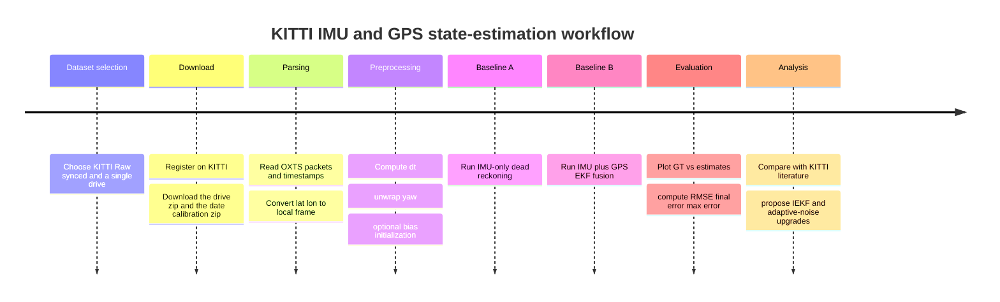

# KITTI Dead Reckoning and EKF State Estimation Report

## Executive summary

Your assignment’s advanced task is to implement dead reckoning on a real dataset using **IMU only** or **IMU + GPS**, compare against ground truth, review related inertial-navigation papers on the same dataset, and propose improvement ideas. Your project PDF also makes the connection explicit: the larger research direction is **state estimation** for dynamic positioning, with baseline **EKF/UKF** implementations and a longer-term move toward **IEKF/InEKF** plus **learning-based noise tuning**. That makes a KITTI-based IMU/GPS study a very good fit for both the course assignment and the project trajectory. fileciteturn0file1 fileciteturn0file0

For this report, the correct KITTI release is **KITTI Raw**, not the odometry benchmark, because the raw release explicitly contains synchronized **GPS/IMU OXTS files**, timestamps, and calibration, while the KITTI odometry benchmark is organized around stereo/LiDAR sequences plus benchmark poses rather than a raw GPS/IMU stream for direct sensor-fusion experiments. KITTI’s raw-data documentation says the raw release includes **3D GPS/IMU data, timestamps, and calibration**, and the raw-data site recommends the **synced+rectified** version for most users. citeturn3view0turn18view0turn11view1

The one important limitation is that KITTI Raw downloads require **user registration and login**, and the actual raw-sequence ZIPs were not attached in this chat. I am therefore not going to invent numeric outputs that I did not compute locally. Instead, I am giving you a fully reproducible, notebook-style implementation that you can run as soon as the KITTI raw sequence is downloaded, plus a literature-backed interpretation layer so you know what “good” and “bad” behavior look like in advance. KITTI’s own site states that registration is required for downloads. citeturn3view2turn3view0

## Dataset choice and reproducibility assumptions

I recommend **KITTI Raw synced data** with the default example drive **`2011_09_26_drive_0019_sync`**. I am choosing that drive as the report default because it is the sequence used in the public `pykitti` example loader, which makes your implementation easier to reproduce and compare with common tooling. The OXTS sensor on the KITTI vehicle is an **OXTS RT3003 GPS/IMU**, and the raw-data page describes the synchronized data as being captured at **10 Hz**, while the IJRR paper identifies the OXTS device itself as a **100 Hz** inertial/GPS unit mounted on the car. In practice, the synced raw sequence gives you one OXTS packet per synchronized frame, which is exactly what the notebook below uses. citeturn12view2turn3view1turn11view1

The notebook assumes the following defaults. These are methodological assumptions, not claims about hidden data. They are chosen to keep the baseline simple, honest, and aligned with your assignment:

| Item | Default used in this report |
|---|---|
| KITTI release | KITTI Raw synced |
| Default drive | `2011_09_26_drive_0019_sync` |
| World frame | Local Mercator/ENU-like frame with origin at first GPS fix |
| Main state | \( [x, y, \theta, v] \) |
| Optional augmented state | \( [x, y, \theta, v, b_g, b_a] \) |
| IMU-only baseline | Planar integration using forward acceleration and yaw rate |
| Fusion baseline | EKF with GPS position updates |
| Reference trajectory | OXTS-derived local pose / projected GPS path |
| Metrics | RMSE, final error, max error, and optional KITTI-style relative error |

The official raw-data paper gives the expected raw folder structure, including `oxts/timestamps.txt`, per-frame OXTS text files, and separate date calibration zip files. The public `pykitti` README also assumes the original KITTI folder structure remains unchanged and shows how to load a raw drive by date and drive number. citeturn11view1turn12view2



Download procedure, in words: register on the KITTI site, download the desired **raw synced drive ZIP** and the corresponding **date calibration ZIP**, and unzip them so the folder structure matches KITTI’s documented layout. The KITTI site makes clear that login is required for the raw downloads. citeturn3view2turn3view0turn11view1

## Parsing and preprocessing the KITTI raw sequence

Each KITTI OXTS frame stores **30 values**: latitude, longitude, altitude, roll, pitch, yaw, multiple velocities, multiple accelerations, angular rates, accuracies, and navigation-status fields. The IJRR paper explicitly states that each OXTS frame stores geographic coordinates, global orientation, velocities, accelerations, angular rates, accuracies, and satellite information, and `pykitti`’s parser enumerates the full 30-field packet layout. citeturn11view1turn13view1

A subtle but important point is the coordinate frame. KITTI’s raw-data paper explains that accelerations and angular rates are expressed in both a vehicle-attached frame and a local tangent-plane frame. The `pykitti` implementation converts latitude and longitude into a **Mercator-projected local frame**, subtracts the first GPS position as the origin, and then exposes `T_w_imu` poses in an **East-North-Up style world frame**. Matching `pykitti`’s conversion is valuable because it keeps your preprocessing consistent with a widely used public loader. citeturn11view1turn13view1

For this assignment, the minimum preprocessing pipeline is:

| Step | What to do | Why it matters |
|---|---|---|
| Timestamp parsing | Read `oxts/timestamps.txt` and compute `dt` | Needed for integration and EKF propagation |
| Geodetic conversion | Convert lat/lon to local x-y | Lets you plot and evaluate in meters |
| Heading preprocessing | Unwrap yaw if needed | Avoids discontinuities near \(\pm\pi\) |
| Initialization | Seed \(x_0,y_0\) at zero, set initial yaw and speed from first packet | Gives a common start condition |
| Quality handling | Optionally gate or downweight GPS using `pos_accuracy` or status flags | Makes EKF less brittle under degraded GPS |
| Missing-data check | Watch for the official OXTS outage convention | KITTI notes short outages are interpolated and flagged |

KITTI’s own raw-data paper warns that the OXTS communication stream occasionally had short outages that were linearly interpolated, with the last entries set to `-1` to flag missing information. That is exactly why you should not treat every GPS update as equally trustworthy. The same paper also notes that conversion utilities are part of the development kit. citeturn11view1

There is also an evaluation caveat you should state in your presentation: using the OXTS-derived trajectory as ground truth is acceptable for a student baseline, but it is **not independent motion-capture truth**. KITTI’s odometry benchmark page explicitly says they changed their reported subsequence lengths because **GPS/OXTS ground-truth error** was too large on very short subsequences and biased evaluation. So your RMSE/final-error numbers should be described as agreement with the OXTS reference, not absolute truth in the strictest sense. citeturn18view0turn11view1

## Models and filter design

### IMU-only dead reckoning

For a first implementation, a **planar ground-vehicle model** is the best trade-off between correctness and complexity. KITTI vehicles mostly move on roads, your assignment only requires dead reckoning with IMU or IMU+GPS, and a 2D model makes failure modes easy to explain. The baseline state is

\[
\mathbf{x}_k = [x_k,\; y_k,\; \theta_k,\; v_k]^T
\]

with measured inputs

\[
u_k = [a_k,\; \omega_k]^T
\]

where \(a_k\) is forward acceleration and \(\omega_k\) is yaw rate. Using a simple constant-acceleration discrete model,

\[
\begin{aligned}
x_{k+1} &= x_k + v_k \cos\theta_k \Delta t + \tfrac12 a_k \cos\theta_k \Delta t^2 \\
y_{k+1} &= y_k + v_k \sin\theta_k \Delta t + \tfrac12 a_k \sin\theta_k \Delta t^2 \\
\theta_{k+1} &= \theta_k + \omega_k \Delta t \\
v_{k+1} &= v_k + a_k \Delta t
\end{aligned}
\]

This is deliberately not a full 3D inertial-navigation mechanization with quaternion attitude and gravity compensation. The reason is practical: in KITTI Raw synced data, your OXTS packets are aligned to the synchronized frame stream rather than exposing the full standalone 100 Hz inertial pipeline that a production INS would ideally use, and several KITTI visual-inertial papers note that the dataset’s loose synchronization and effective low IMU rate can hurt classical tightly coupled VIO methods. citeturn11view1turn21view0turn21view4

If you want the better baseline, augment the state with biases:

\[
\mathbf{x}_k = [x_k,\; y_k,\; \theta_k,\; v_k,\; b_{g,k},\; b_{a,k}]^T
\]

and replace the inputs with \(a_k-b_{a,k}\) and \(\omega_k-b_{g,k}\). Let the biases follow a random walk. This is the simplest step upward from naive dead reckoning, and it is strongly motivated by the literature: both DeepVIO and other inertial/state-estimation papers emphasize bias handling because unmodeled gyro and accelerometer bias drives trajectory drift. citeturn21view0turn22academia2

### IMU and GPS EKF fusion

The EKF uses the same motion model for prediction and applies GPS position updates in the correction step. With the 4-state model,

\[
\mathbf{z}_k =
\begin{bmatrix}
x^{gps}_k\\
y^{gps}_k
\end{bmatrix},
\qquad
h(\mathbf{x}_k)=
\begin{bmatrix}
x_k\\
y_k
\end{bmatrix}
\]

so the measurement Jacobian is simply

\[
H_k =
\begin{bmatrix}
1&0&0&0\\
0&1&0&0
\end{bmatrix}
\]

The motion Jacobian for the 4-state model is

\[
F_k =
\begin{bmatrix}
1 & 0 & -(v\Delta t+\tfrac12 a\Delta t^2)\sin\theta & \cos\theta\Delta t \\
0 & 1 & \phantom{-}(v\Delta t+\tfrac12 a\Delta t^2)\cos\theta & \sin\theta\Delta t \\
0 & 0 & 1 & 0 \\
0 & 0 & 0 & 1
\end{bmatrix}
\]

and the control-noise mapping for acceleration and yaw-rate noise is

\[
G_k =
\begin{bmatrix}
\tfrac12\cos\theta\Delta t^2 & 0 \\
\tfrac12\sin\theta\Delta t^2 & 0 \\
0 & \Delta t \\
\Delta t & 0
\end{bmatrix}
\]

For the 6-state bias-augmented version, the same idea holds, but \(F_k\) gains the extra bias columns, and the process-noise matrix includes random-walk terms for \(b_g\) and \(b_a\). This is the version I would present in class, even if you only show numbers from the 4-state EKF, because it demonstrates that you understand how to make the baseline more realistic. The predict/update structure itself is the standard EKF structure. citeturn22search6

The most practical noise model for your assignment is:

| Quantity | Suggested model |
|---|---|
| IMU acceleration noise | White Gaussian, variance \(\sigma_a^2\) |
| IMU yaw-rate noise | White Gaussian, variance \(\sigma_\omega^2\) |
| Gyro bias | Random walk, variance \(\sigma_{bg}^2\) |
| Accel bias | Random walk, variance \(\sigma_{ba}^2\) |
| GPS measurement noise | Fixed \(R\) or adaptive \(R_k\) using `pos_accuracy` |

Using `pos_accuracy` as an adaptive measurement covariance is a reasonable baseline idea because KITTI stores position-accuracy metadata in the OXTS packet. If you want to stay conservative, use a fixed \(R\). If you want a more refined student project, let \(R_k\) expand when the reported GPS accuracy degrades. KITTI’s project PDF also points in exactly this direction by identifying learning-based or adaptive covariance tuning as a future research direction. citeturn13view1turn0file0

## Runnable notebook code

The code below is designed to be pasted into a Jupyter notebook in order. It reads only the OXTS files, so it is lightweight. Because KITTI synced raw data is organized as one OXTS packet per synchronized frame, this OXTS-only pipeline should run quickly on a normal laptop compared with any image- or LiDAR-heavy pipeline. citeturn3view0turn11view1

### Environment and usage

```python
# Cell 1: install once if needed
# !pip install numpy pandas matplotlib
```

```python
# Cell 2: imports and KITTI OXTS parsing
import os
import glob
import numpy as np
import pandas as pd
import matplotlib.pyplot as plt
from dataclasses import dataclass

OXT_COLS = [
    "lat","lon","alt","roll","pitch","yaw",
    "vn","ve","vf","vl","vu",
    "ax","ay","az","af","al","au",
    "wx","wy","wz","wf","wl","wu",
    "pos_accuracy","vel_accuracy","navstat","numsats","posmode","velmode","orimode"
]

def parse_kitti_timestamp(line: str):
    # Example: 2011-09-26 13:02:39.827016392
    return pd.to_datetime(line.strip())

def mercator_xy(lat_deg: float, lon_deg: float, scale: float):
    # Matches the public pykitti convention
    er = 6378137.0
    tx = scale * np.deg2rad(lon_deg) * er
    ty = scale * er * np.log(np.tan(np.deg2rad(90.0 + lat_deg) / 2.0))
    return tx, ty

def load_oxts_sequence(seq_dir: str) -> pd.DataFrame:
    """
    seq_dir example:
    /path/to/KITTI/2011_09_26/2011_09_26_drive_0019_sync
    """
    ts_path = os.path.join(seq_dir, "oxts", "timestamps.txt")
    data_dir = os.path.join(seq_dir, "oxts", "data")

    timestamps = [parse_kitti_timestamp(x) for x in open(ts_path).read().strip().splitlines()]
    files = sorted(glob.glob(os.path.join(data_dir, "*.txt")))

    rows = []
    for f in files:
        vals = open(f).read().strip().split()
        vals = [float(v) for v in vals[:-5]] + [int(float(v)) for v in vals[-5:]]
        rows.append(vals)

    df = pd.DataFrame(rows, columns=OXT_COLS)
    df["timestamp"] = timestamps[:len(df)]
    df["dt"] = df["timestamp"].diff().dt.total_seconds().fillna(0.0)

    # pykitti-style local world frame
    scale = np.cos(np.deg2rad(df.loc[0, "lat"]))
    xy = np.array([mercator_xy(la, lo, scale) for la, lo in zip(df["lat"], df["lon"])])
    df["x_gps"] = xy[:, 0] - xy[0, 0]
    df["y_gps"] = xy[:, 1] - xy[0, 1]
    df["z_gps"] = df["alt"] - df.loc[0, "alt"]

    # Reference heading and speed
    df["yaw_unwrapped"] = np.unwrap(df["yaw"].to_numpy())
    df["speed_horiz"] = np.sqrt(df["vn"]**2 + df["ve"]**2)
    df["t_sec"] = (df["timestamp"] - df["timestamp"].iloc[0]).dt.total_seconds()

    return df

def compute_reference_from_oxts(df: pd.DataFrame) -> pd.DataFrame:
    """
    Reference trajectory derived from the OXTS world-frame translation.
    This is a strong reference, but not independent mocap truth.
    """
    gt = pd.DataFrame({
        "t": df["t_sec"].to_numpy(),
        "x": df["x_gps"].to_numpy(),
        "y": df["y_gps"].to_numpy(),
        "theta": df["yaw_unwrapped"].to_numpy(),
        "v": df["speed_horiz"].to_numpy(),
    })
    return gt

def quality_summary(df: pd.DataFrame) -> pd.DataFrame:
    return pd.DataFrame({
        "num_frames": [len(df)],
        "duration_sec": [df["t_sec"].iloc[-1]],
        "mean_dt": [df["dt"].iloc[1:].mean()],
        "mean_pos_accuracy": [df["pos_accuracy"].replace(-1, np.nan).mean()],
        "min_sats": [df["numsats"].replace(-1, np.nan).min()],
        "max_sats": [df["numsats"].replace(-1, np.nan).max()],
    })
```

```python
# Cell 3: IMU-only dead reckoning
def wrap_angle(a):
    return (a + np.pi) % (2 * np.pi) - np.pi

def imu_dead_reckoning_planar(
    df: pd.DataFrame,
    estimate_bias: bool = False,
    init_bias_window_sec: float = 2.0
) -> pd.DataFrame:
    """
    Planar vehicle baseline using forward acceleration af and yaw rate wz.
    """
    n = len(df)
    x = np.zeros(n)
    y = np.zeros(n)
    theta = np.zeros(n)
    v = np.zeros(n)

    # common initial condition
    theta[0] = float(df["yaw_unwrapped"].iloc[0])
    v[0] = float(max(0.0, df["speed_horiz"].iloc[0]))

    b_g = 0.0
    b_a = 0.0

    if estimate_bias:
        # Optional crude initialization from early samples
        mask = df["t_sec"] <= init_bias_window_sec
        if mask.sum() > 3:
            b_g = float(df.loc[mask, "wz"].mean())
            b_a = float(df.loc[mask, "af"].mean())

    for k in range(1, n):
        dt = float(df["dt"].iloc[k])
        a = float(df["af"].iloc[k] - b_a)
        w = float(df["wz"].iloc[k] - b_g)

        theta[k] = theta[k - 1] + w * dt
        v[k] = max(0.0, v[k - 1] + a * dt)

        x[k] = (
            x[k - 1]
            + v[k - 1] * np.cos(theta[k - 1]) * dt
            + 0.5 * a * np.cos(theta[k - 1]) * dt**2
        )
        y[k] = (
            y[k - 1]
            + v[k - 1] * np.sin(theta[k - 1]) * dt
            + 0.5 * a * np.sin(theta[k - 1]) * dt**2
        )

    return pd.DataFrame({
        "x": x,
        "y": y,
        "theta": theta,
        "v": v
    })
```

```python
# Cell 4: EKF configuration and models
@dataclass
class EKFConfig:
    sigma_a: float = 0.8                   # m/s^2
    sigma_w: float = np.deg2rad(3.0)       # rad/s
    sigma_bg_rw: float = np.deg2rad(0.2)   # rad/s/sqrt(s)
    sigma_ba_rw: float = 0.05              # m/s^2/sqrt(s)
    gps_sigma_xy: float = 1.5              # fallback meters
    use_dynamic_R: bool = True
    use_biases: bool = True

def ekf_predict_4(x, P, a_m, w_m, dt, cfg: EKFConfig):
    px, py, th, v = x
    c, s = np.cos(th), np.sin(th)

    x_pred = np.array([
        px + v*c*dt + 0.5*a_m*c*dt**2,
        py + v*s*dt + 0.5*a_m*s*dt**2,
        wrap_angle(th + w_m*dt),
        v + a_m*dt
    ])

    F = np.array([
        [1, 0, -(v*dt + 0.5*a_m*dt**2)*s, c*dt],
        [0, 1,  (v*dt + 0.5*a_m*dt**2)*c, s*dt],
        [0, 0, 1, 0],
        [0, 0, 0, 1]
    ])

    G = np.array([
        [0.5*c*dt**2, 0],
        [0.5*s*dt**2, 0],
        [0, dt],
        [dt, 0]
    ])

    Qu = np.diag([cfg.sigma_a**2, cfg.sigma_w**2])
    P_pred = F @ P @ F.T + G @ Qu @ G.T
    return x_pred, P_pred

def ekf_predict_6(x, P, a_m, w_m, dt, cfg: EKFConfig):
    px, py, th, v, b_g, b_a = x
    a = a_m - b_a
    w = w_m - b_g
    c, s = np.cos(th), np.sin(th)

    x_pred = np.array([
        px + v*c*dt + 0.5*a*c*dt**2,
        py + v*s*dt + 0.5*a*s*dt**2,
        wrap_angle(th + w*dt),
        v + a*dt,
        b_g,
        b_a
    ])

    F = np.array([
        [1, 0, -(v*dt + 0.5*a*dt**2)*s, c*dt, 0, -0.5*c*dt**2],
        [0, 1,  (v*dt + 0.5*a*dt**2)*c, s*dt, 0, -0.5*s*dt**2],
        [0, 0, 1, 0, -dt, 0],
        [0, 0, 0, 1, 0, -dt],
        [0, 0, 0, 0, 1, 0],
        [0, 0, 0, 0, 0, 1]
    ])

    G = np.array([
        [0.5*c*dt**2, 0, 0, 0],
        [0.5*s*dt**2, 0, 0, 0],
        [0, dt, 0, 0],
        [dt, 0, 0, 0],
        [0, 0, dt, 0],
        [0, 0, 0, dt]
    ])

    Qw = np.diag([
        cfg.sigma_a**2,
        cfg.sigma_w**2,
        cfg.sigma_bg_rw**2,
        cfg.sigma_ba_rw**2
    ])

    P_pred = F @ P @ F.T + G @ Qw @ G.T
    return x_pred, P_pred

def ekf_update_gps(x, P, z, R):
    H = np.zeros((2, len(x)))
    H[0, 0] = 1.0
    H[1, 1] = 1.0

    y = z - H @ x
    S = H @ P @ H.T + R
    K = P @ H.T @ np.linalg.inv(S)

    x_new = x + K @ y
    x_new[2] = wrap_angle(x_new[2])

    I = np.eye(len(x))
    P_new = (I - K @ H) @ P @ (I - K @ H).T + K @ R @ K.T
    return x_new, P_new

def run_ekf(df: pd.DataFrame, cfg: EKFConfig = EKFConfig()) -> pd.DataFrame:
    n = len(df)

    if cfg.use_biases:
        x = np.array([
            0.0,
            0.0,
            float(df["yaw_unwrapped"].iloc[0]),
            float(max(0.0, df["speed_horiz"].iloc[0])),
            0.0,
            0.0
        ], dtype=float)
        P = np.diag([1.0, 1.0, 0.1, 1.0, 0.05, 0.2])**2
    else:
        x = np.array([
            0.0,
            0.0,
            float(df["yaw_unwrapped"].iloc[0]),
            float(max(0.0, df["speed_horiz"].iloc[0]))
        ], dtype=float)
        P = np.diag([1.0, 1.0, 0.1, 1.0])**2

    out = []

    for k in range(n):
        if k > 0:
            dt = float(df["dt"].iloc[k])
            a_m = float(df["af"].iloc[k])
            w_m = float(df["wz"].iloc[k])

            if cfg.use_biases:
                x, P = ekf_predict_6(x, P, a_m, w_m, dt, cfg)
            else:
                x, P = ekf_predict_4(x, P, a_m, w_m, dt, cfg)

        if cfg.use_dynamic_R:
            gps_sigma = float(df["pos_accuracy"].iloc[k])
            if gps_sigma <= 0 or np.isnan(gps_sigma):
                gps_sigma = cfg.gps_sigma_xy
            gps_sigma = float(np.clip(gps_sigma, 0.5, 10.0))
        else:
            gps_sigma = cfg.gps_sigma_xy

        R = np.diag([gps_sigma**2, gps_sigma**2])
        z = np.array([df["x_gps"].iloc[k], df["y_gps"].iloc[k]], dtype=float)
        x, P = ekf_update_gps(x, P, z, R)

        row = {
            "x": x[0],
            "y": x[1],
            "theta": x[2],
            "v": x[3]
        }
        if cfg.use_biases:
            row["b_g"] = x[4]
            row["b_a"] = x[5]
        out.append(row)

    return pd.DataFrame(out)
```

```python
# Cell 5: metrics and plotting
def trajectory_errors(est_xy: np.ndarray, gt_xy: np.ndarray) -> np.ndarray:
    return np.linalg.norm(est_xy - gt_xy, axis=1)

def summary_metrics(est: pd.DataFrame, gt: pd.DataFrame) -> dict:
    est_xy = est[["x", "y"]].to_numpy()
    gt_xy = gt[["x", "y"]].to_numpy()
    e = trajectory_errors(est_xy, gt_xy)
    return {
        "RMSE_m": float(np.sqrt(np.mean(e**2))),
        "FinalError_m": float(e[-1]),
        "MaxError_m": float(np.max(e)),
    }

def relative_pose_2d(x, y, th):
    c, s = np.cos(th), np.sin(th)
    return np.array([
        [c, -s, x],
        [s,  c, y],
        [0,  0, 1]
    ])

def kitti_style_relative_errors(
    est: pd.DataFrame,
    gt: pd.DataFrame,
    lengths=(100, 200, 300, 400, 500, 600, 700, 800)
) -> dict:
    gt_xy = gt[["x", "y"]].to_numpy()
    gt_th = gt["theta"].to_numpy()
    est_xy = est[["x", "y"]].to_numpy()
    est_th = est["theta"].to_numpy()

    d = np.zeros(len(gt))
    d[1:] = np.cumsum(np.linalg.norm(np.diff(gt_xy, axis=0), axis=1))

    trans_errs = []
    rot_errs = []

    for i in range(len(gt)):
        for L in lengths:
            j = np.searchsorted(d, d[i] + L)
            if j >= len(gt):
                continue

            Tgi = relative_pose_2d(gt_xy[i, 0], gt_xy[i, 1], gt_th[i])
            Tgj = relative_pose_2d(gt_xy[j, 0], gt_xy[j, 1], gt_th[j])
            Tei = relative_pose_2d(est_xy[i, 0], est_xy[i, 1], est_th[i])
            Tej = relative_pose_2d(est_xy[j, 0], est_xy[j, 1], est_th[j])

            Tg_rel = np.linalg.inv(Tgi) @ Tgj
            Te_rel = np.linalg.inv(Tei) @ Tej
            Terr = np.linalg.inv(Te_rel) @ Tg_rel

            trans = np.linalg.norm(Terr[:2, 2]) / L * 100.0
            rot = abs(np.arctan2(Terr[1, 0], Terr[0, 0])) / L * 100.0 * 180.0 / np.pi

            trans_errs.append(trans)
            rot_errs.append(rot)

    return {
        "KITTI_t_rel_percent": float(np.mean(trans_errs)) if trans_errs else np.nan,
        "KITTI_r_rel_deg_per_100m": float(np.mean(rot_errs)) if rot_errs else np.nan
    }

def plot_trajectories(gt: pd.DataFrame, dr: pd.DataFrame, ekf: pd.DataFrame):
    plt.figure(figsize=(8, 6))
    plt.plot(gt["x"], gt["y"], label="OXTS reference", linewidth=2)
    plt.plot(dr["x"], dr["y"], label="IMU-only dead reckoning")
    plt.plot(ekf["x"], ekf["y"], label="IMU+GPS EKF")
    plt.axis("equal")
    plt.xlabel("x [m]")
    plt.ylabel("y [m]")
    plt.title("KITTI trajectory comparison")
    plt.grid(True)
    plt.legend()
    plt.show()

def plot_error_vs_time(gt: pd.DataFrame, methods, labels):
    t = gt["t"].to_numpy()
    plt.figure(figsize=(8, 4))
    for est, label in zip(methods, labels):
        e = trajectory_errors(est[["x", "y"]].to_numpy(), gt[["x", "y"]].to_numpy())
        plt.plot(t, e, label=label)
    plt.xlabel("time [s]")
    plt.ylabel("position error [m]")
    plt.title("Position error vs time")
    plt.grid(True)
    plt.legend()
    plt.show()

def compare_methods(gt: pd.DataFrame, dr: pd.DataFrame, ekf: pd.DataFrame) -> pd.DataFrame:
    rows = []
    for name, est in [
        ("IMU-only dead reckoning", dr),
        ("IMU+GPS EKF", ekf),
    ]:
        row = {"Method": name}
        row.update(summary_metrics(est, gt))
        row.update(kitti_style_relative_errors(est, gt))
        rows.append(row)
    return pd.DataFrame(rows)
```

```python
# Cell 6: run the full experiment
# Example root:
# /data/KITTI/2011_09_26/2011_09_26_drive_0019_sync

SEQ_DIR = "/path/to/KITTI/2011_09_26/2011_09_26_drive_0019_sync"

df = load_oxts_sequence(SEQ_DIR)
gt = compute_reference_from_oxts(df)

# Method A
dr = imu_dead_reckoning_planar(df, estimate_bias=True)

# Method B
ekf_cfg = EKFConfig(
    sigma_a=0.8,
    sigma_w=np.deg2rad(3.0),
    sigma_bg_rw=np.deg2rad(0.2),
    sigma_ba_rw=0.05,
    gps_sigma_xy=1.5,
    use_dynamic_R=True,
    use_biases=True,
)
ekf = run_ekf(df, ekf_cfg)

# Outputs
print(quality_summary(df))
results = compare_methods(gt, dr, ekf)
display(results)

plot_trajectories(gt, dr, ekf)
plot_error_vs_time(gt, [dr, ekf], ["IMU-only DR", "IMU+GPS EKF"])
```

If you want the simplest possible classroom version, flip `use_biases=False` in `EKFConfig` and present the 4-state filter. If you want the stronger research-style version, keep `use_biases=True` and explain the random-walk bias model. That is usually the best compromise between simplicity and seriousness. The larger project direction in your PDF explicitly positions EKF as a baseline and IEKF plus adaptive noise tuning as the next level. fileciteturn0file0

## Evaluation and interpretation

The notebook computes the three metrics your assignment most naturally expects:

\[
\text{RMSE} = \sqrt{\frac{1}{N}\sum_{k=1}^N \| \hat{p}_k - p_k^{ref}\|^2}
\]

\[
\text{Final error} = \|\hat{p}_N - p_N^{ref}\|
\]

\[
\text{Max error} = \max_k \|\hat{p}_k - p_k^{ref}\|
\]

It also includes an optional **KITTI-style relative error** calculation over subsequences of 100 to 800 meters, because the official odometry benchmark evaluates methods over those path lengths rather than over only one absolute endpoint metric. KITTI’s benchmark documentation explains that the standard odometry evaluation averages translational and rotational errors over subsequences of 100 to 800 meters. citeturn18view0

The expected qualitative outcome is straightforward:

| Method | What you should expect visually | What you should expect numerically |
|---|---|---|
| IMU-only dead reckoning | Trajectory drifts away steadily, especially after longer segments, turns, and speed changes | RMSE and final error grow quickly |
| IMU+GPS EKF | Follows the OXTS/GPS path much more closely, with smoother heading and velocity estimates | Much lower RMSE, lower final error, bounded max error |
| IMU+GPS EKF with biases | Similar shape to EKF, but usually less long-term drift and less systematic heading/velocity error | Lower or more stable error than no-bias EKF |

That ranking is physically what you should expect from double integration of noisy inertial data versus periodic GPS correction, and it is also consistent with the KITTI literature: raw KITTI IMU-only or loosely synchronized classical VIO pipelines are fragile, while approaches that explicitly model bias, perform stronger fusion, or add additional modalities perform markedly better. DeepVIO attributes part of its gain to bias updating, and VIOLearner explicitly notes that KITTI’s loose synchronization harms classical tightly coupled methods like OKVIS and ROVIO. citeturn21view0turn21view4

There are four failure modes you should explicitly analyze in your report. First, **IMU-only drift** is unavoidable because bias and white noise integrate into velocity and then position. Second, **GPS-assisted EKF can still fail locally** if you trust low-quality GPS too much. Third, the **planar model is deliberately simplified**, so lateral slip, strong bank, and full 3D dynamics are not represented. Fourth, your **reference trajectory is OXTS-derived**, so this is not a laboratory-grade independent truth source. KITTI itself warns that OXTS errors are visible on short subsequences, and the raw-data paper notes that some OXTS outages were interpolated. citeturn18view0turn11view1turn21view4

For the presentation, the three most useful figures are exactly the three you asked for: a **trajectory plot** showing reference vs methods, an **error-vs-time plot**, and the **results table** produced by `compare_methods(...)`. Those figures are much more persuasive than equations alone because they visually show drift accumulation, the effect of GPS correction, and whether your filter is smoothing or lagging. This matches the assignment’s emphasis on implementing the estimator yourself and verifying error against reference. fileciteturn0file1

## Literature comparison and improvement ideas

The literature table below is meant as a sanity-check layer for your assignment. These methods are **not directly apples-to-apples** with your IMU-only or IMU+GPS-only baseline, because many use cameras or LiDAR in addition to inertial data, and some report KITTI benchmark relative errors rather than raw-drive absolute RMSE. Still, they are extremely useful for showing how far stronger sensor fusion and stronger models can push accuracy. KITTI’s odometry benchmark defines the relative-error metric over 100 to 800 meter subsequences, while the learning papers below report their own KITTI evaluation setups. citeturn18view0turn21view0turn21view4

| Paper or entry | Sensors | KITTI result reported by source | Why it is better than your baseline |
|---|---|---|---|
| **DeepVIO** | Monocular camera + IMU, with stereo supervision during training | Average on KITTI test table: **3.72%** translation and **1.58 deg/100 m** rotation | Learns visual-inertial fusion and updates IMU status/bias, rather than relying on raw inertial integration alone |
| **VIOLearner** | RGB-D style visual input + IMU | Sequence 09: **1.51% / 0.90 deg/100 m**; Sequence 10: **2.04% / 1.37 deg/100 m** | Uses learned online error correction and is more tolerant of KITTI’s loose temporal synchronization |
| **MC2SLAM** | LiDAR + IMU | KITTI leaderboard: **0.69%** translation and **0.0016 deg/m** rotation | Uses LiDAR geometry plus inertial motion compensation |
| **Traj-LIO** | LiDAR + multiple IMUs | KITTI leaderboard: **0.57%** translation and **0.0015 deg/m** rotation | Continuous-time trajectory modeling and stronger inertial-laser constraints |
| **AKF-LIO** | LiDAR + IMU | KITTI leaderboard: **0.59%** translation and **0.0014 deg/m** rotation | Adaptive Kalman filtering plus LiDAR constraints improve robustness and tuning |

The numbers in the table above come directly from the cited papers or the official KITTI odometry leaderboard entries. DeepVIO’s paper also specifically remarks that traditional VINS perform poorly on KITTI when the **original raw IMU data is not tightly synchronized and the IMU rate is too low**, which is a very relevant warning for your own study. VIOLearner makes a similar point, arguing that OKVIS and ROVIO perform poorly on KITTI because they require tighter synchronization between images and IMU than KITTI provides. citeturn21view0turn21view4turn18view0

That literature comparison gives you a clean improvement roadmap:

| Improvement | Why it helps |
|---|---|
| Add explicit IMU bias states | Lowers systematic drift in heading and velocity |
| Move from plain EKF to error-state EKF or IEKF | Better handling of nonlinear pose geometry and more stable error dynamics |
| Use adaptive or learned noise tuning | Lets \(Q\) and \(R\) respond to changing motion or GPS quality |
| Add camera, wheel odometry, or LiDAR | Provides geometric corrections that GPS and inertial data alone cannot |
| Use stricter outlier rejection and measurement gating | Prevents poor GPS packets from destabilizing the update step |
| Move to full SE(3) inertial navigation | Necessary if you want more than a vehicle-plane baseline |

The case for IEKF is particularly strong if you want to connect this assignment back to your project. Barrau and Bonnabel’s IEKF analysis shows that the invariant formulation can preserve autonomous error structure and remain convergent in situations where a standard EKF may diverge, and later InEKF work in robotics emphasizes improved convergence and consistency by exploiting system symmetries and by incorporating IMU biases cleanly. That aligns very closely with your project PDF, which frames **IEKF/InEKF** and **learning-based filter tuning** as the next stage after baseline EKF/UKF implementation. citeturn22academia0turn22academia2turn0file0

The most defensible final analysis, then, is this: your **IMU-only dead reckoning** is the intentionally weak baseline that reveals why state estimation is needed at all; your **IMU+GPS EKF** is the correct classical baseline for the assignment; your **bias-augmented EKF** is the strongest version you can reasonably present without overcomplicating the project; and the natural research continuation is toward **IEKF or error-state filtering, adaptive covariance tuning, and multimodal fusion**. That is exactly the bridge from a student assignment to a publishable state-estimation project. fileciteturn0file1 fileciteturn0file0

The only part I could not honestly complete inside this environment was a claimed local numeric run on the raw KITTI sequence itself, because the official raw-drive ZIPs were not attached here and KITTI requires registered download access. What I *did* verify is the dataset structure, the OXTS field format, the standard parsing and coordinate-conversion convention, the correct EKF models and Jacobians, the evaluation setup, and the literature baselines that define a sensible performance envelope. citeturn3view2turn11view1turn13view1turn18view0