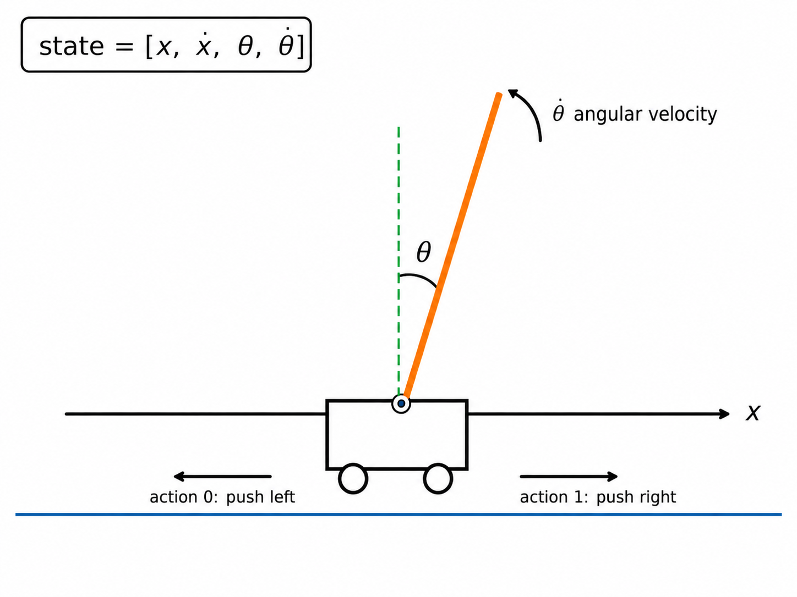

# CartPole Imitation Learning

This student project is designed to introduce the basics of robotics, control theory, and imitation learning using the OpenAI Gym `CartPole-v1` environment.

## Project Overview

The CartPole environment simulates a cart with a pole attached to it. Because of gravity, the pole naturally tends to fall. The goal is to move the cart left or right so that the pole remains upright for as long as possible.

In reinforcement learning, an agent can learn this behavior through trial and error. In this project, however, we use **imitation learning**. Instead of learning only from rewards, the student policy learns by imitating an expert policy.

The overall idea is:

```text
state → expert policy → expert action
```

We first create a rule-based expert policy, collect demonstrations from that expert, and then train a model to imitate its decisions.

## CartPole Environment

The CartPole environment provides the current state of the system as:

```text
[x, ẋ, theta, θ̇ ]
```

| Variable    | Meaning               | Description                                      |
| ----------- | --------------------- | ------------------------------------------------ |
| `x`         | Cart position         | The horizontal position of the cart              |
| `ẋ`     | Cart velocity         | The speed of the cart                            |
| `θ`     | Pole angle            | The angle of the pole from the vertical position |
| `θ̇ ` | Pole angular velocity | The speed at which the pole is rotating          |

## Action Space

The policy takes the current state and returns an action:

```text
policy(state) = action
```

There are two possible actions:

| Action | Meaning                    |
| ------ | -------------------------- |
| `0`    | Push the cart to the left  |
| `1`    | Push the cart to the right |

## Expert Policy

To collect demonstration data, we first define an expert policy.

A **policy** is a function that takes the current state as input and returns an action. In this project, the expert policy is implemented as a simple rule-based feedback controller.

The expert policy uses the CartPole state values to decide whether the cart should move left or right in order to keep the pole balanced.




## Reward

The environment gives a reward of `+1` for every time step that the pole stays balanced

A higher total reward means the pole remained upright for a longer period of time

## Procedure

1. Create an expert policy using a rule-based linear feedback controller
2. Collect demonstration data from the expert policy
3. Train an imitation learning policy using the expert demonstrations
4. Test the learned policy in the CartPole environment
5. Compare the learned policy’s performance with the expert policy

## Goal

The goal of this project is to understand how an agent can learn control behavior by observing expert demonstrations. Through this project, we explore the connection between classical control, robotics, and machine learning!!
